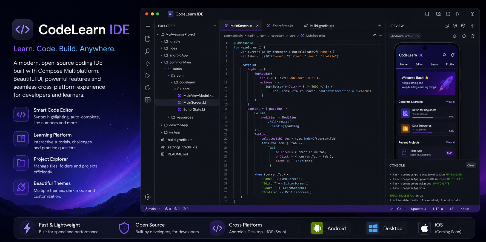

<p align="center">
  
</p>

<div align="center">

# 💻 CodeLearn IDE

### 🚀 An Open-Source Coding IDE built with Compose Multiplatform

Modern • Fast • Cross Platform • Beautiful UI

<p align="center">


</p>

</div>

---

# ✨ About

**CodeLearn IDE** is a modern, open-source coding environment built with **Compose Multiplatform**.

The goal is to provide developers and students with a beautiful coding experience that works across multiple platforms while supporting learning, experimentation, and software development.

Whether you're learning Kotlin, practicing algorithms, or building production code, CodeLearn IDE aims to make coding enjoyable.

---

# 🎯 Why CodeLearn IDE?

Unlike traditional code editors, CodeLearn IDE is designed for developers and learners.

It combines

- 💻 Code Editing
- 📚 Learning
- 🎨 Beautiful UI
- ⚡ Fast Performance
- 🌍 Cross Platform
- ❤️ Open Source

into one application.

---

# 🚀 Features

## 💻 Code Editor

- Smart Editor
- Syntax Highlighting
- Auto Indentation
- Line Numbers
- Multiple Themes
- Fast Rendering

---

## 📚 Learning Platform

- Interactive Lessons
- Practice Questions
- Coding Challenges
- Tutorials
- Example Projects

---

## 🎨 Modern UI

- Material 3
- Compose Multiplatform
- Dynamic Colors
- Dark Theme
- Responsive Layout
- Smooth Animations

---

## ⚡ Productivity

- File Explorer
- Multiple Tabs
- Search
- Keyboard Shortcuts
- Project Navigation

---

## 🌍 Cross Platform

Supports

- ✅ Android
- ✅ Desktop
- 🚧 iOS (Coming Soon)
- 🚧 Web (Planned)

---


# 🏗 Tech Stack

## Language

- Kotlin

## UI

- Compose Multiplatform
- Material 3

## Architecture

- MVVM
- Clean Architecture
- Modular Architecture

## Libraries

- Coroutines
- Flow
- Ktor
- Kotlin Serialization
- Navigation
- Coil
- Koin/Hilt

---

# 📦 Project Structure

```
CodeLearnIDE/
├── composeApp/           # Shared UI + logic (KMP)
│   └── src/
│       ├── commonMain/   # Shared Kotlin code
│       ├── androidMain/  # Android-specific
│       └── desktopMain/  # Desktop-specific
├── gradle/
├── build.gradle.kts
└── settings.gradle.kts
```

---

# 🎯 Roadmap

## Version 1

- [x] Compose UI
- [x] Editor
- [x] Material 3
- [ ] File Explorer
- [ ] Themes
- [ ] Settings

---

## Version 2

- [ ] AI Code Assistant
- [ ] Git Integration
- [ ] Plugin Support
- [ ] Terminal
- [ ] Project Templates

---

## Version 3

- [ ] LeetCode Practice
- [ ] Coding Playground
- [ ] Compiler Integration
- [ ] Live Collaboration
- [ ] Cloud Sync

---

# ❤️ Why Open Source?

CodeLearn IDE is built for the developer community.

Contributions are welcome!

You can help by

- Reporting Bugs
- Improving Documentation
- Fixing Issues
- Adding Features
- Sharing Ideas

---

# 🤝 Contributing

```bash
Fork the repository

↓

Create a feature branch

↓

Commit your changes

↓

Push your branch

↓

Open a Pull Request
```

---

# ⭐ Support

If you like this project,

please consider giving it a ⭐ on GitHub.

It helps the project grow and motivates future development.

---

# 👨‍💻 Author

**Ishant Sharma**

Senior Android Engineer

Open Source Maintainer

Compose Multiplatform Developer

🌐 Website

https://www.ishant.info

GitHub

https://github.com/Kratos1996

LinkedIn

https://www.linkedin.com/in/androiddeveloperishant

---

# 📄 License

Licensed under the MIT License.

---

<p align="center">
  
</p>

<div align="center">

## ⭐ Star the repository if you find it useful!

**Building the future of cross-platform development with Kotlin & Compose Multiplatform 🚀**

</div>


## License
This project is licensed under the MIT License - see the [LICENSE](LICENSE) file for details.
